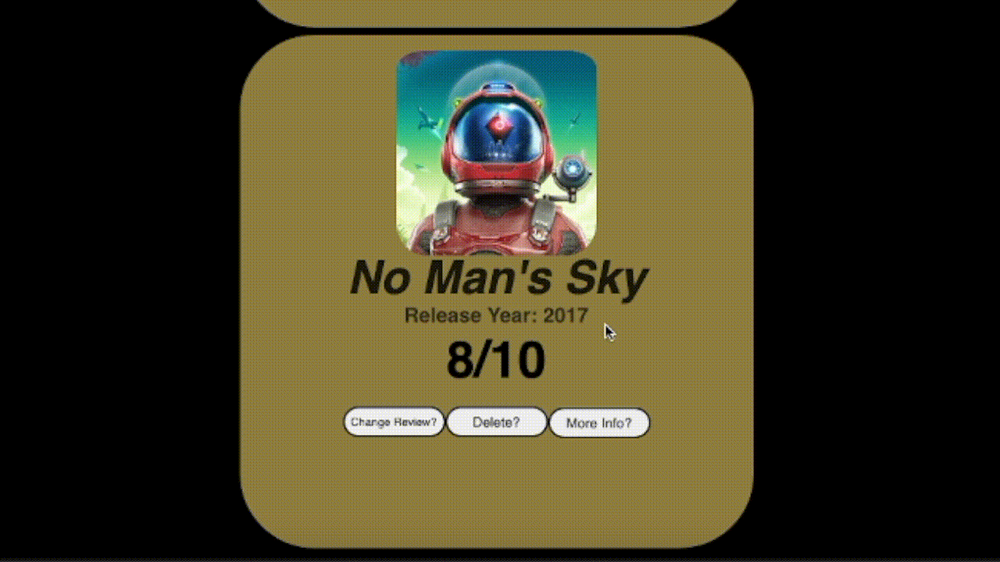

# Thank you for downloading Bob's Game Reviews!

Bob's Game reviews is a single page application created by Bobby De Luna as a final project for the third phase of the Flatiron School's software engineering program.

This application is used for looking at, reviewing, and creating, simple video game reviews!

# Installation

The current directory where this document is located is the frontend portion of Bob's Game Reviews.

In order to run the application please download the backend portion of the app using this link:

https://github.com/Hushtonebob/Phase3-Project-Backend

# Usage

To properly set up the frontend portion of this application run the following command in the current directory:

# This will launch the server for Bob's Game Reviews
$ npm start

From the backend directory run the following command to launch the backend portion of this app.

This will launch the backend potion of the application. 
$ rake server

## Features

## Create a new game entry

## Update the review

## Get back dynamic info about the game

## Delete entries

